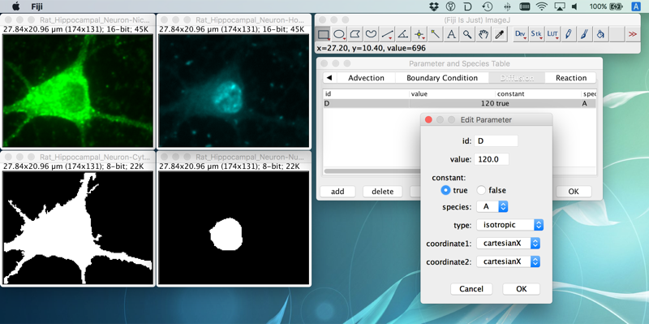
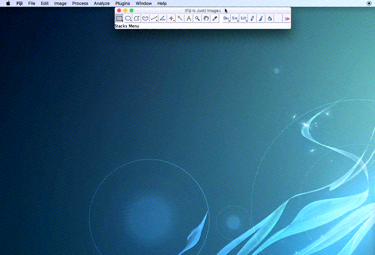
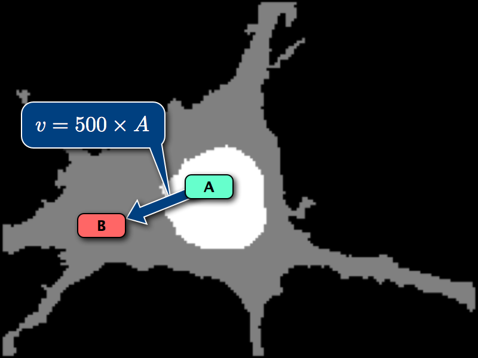

XitoSBML: Spatial SBML Plugin for ImageJ
======================
XitoSBML is an [ImageJ](https://imagej.net/Welcome) plugin which creates a [Spatial SBML](http://sbml.org/Documents/Specifications/SBML_Level_3/Packages/spatial) model from segmented images.
XitoSBML is not just a converter, but also a spatial model editor so that users can add molecules(species), reactions and advection/diffusion coefficients to the converted Spatial SBML model.



How to Install
------------------
1. Launch ImageJ (Fiji)
2. Click [Help] -> [Update...]
3. Click [Manage update sites] button on [ImageJ Updater] dialog
4. On [Manage update sites dialog], scroll down the list of update sites, turn on [XitoSBML] checkbox and press [Close] button
5. Click [Apply changes] button on [ImageJ Updater] dialog
6. ImageJ (Fiji) will download and install XitoSBML and its dependent libraries
7. Restart ImageJ (Fiji), then you will find [XitoSBML] plugin under [Plugins] menu

Here is a screencast of above installation procedure (screencast is also
available as an [MP4 file](./screenshots/install-xitosbml.mp4)).


How to Use
-------------------
### Convert segmented images to Spatial SBML (which contains simulation space only)
1. Launch ImageJ (Fiji)
2. Load original images (not mandatory) and their segmented images
3. Click [Plugins] -> [XitoSBML] -> [run Spatial Image SBML Plugin]
4. On [DomainType Namer] dialog, assign an opened image to each organelle (ex. nucleus, cytosol)
5. XitoSBML will ask whether you want to add SBML objects (Species, Reactions and Parameters) to the converted Spatial SBML model. If you just want to convert your image files to Spatial SBML, then just click [No]
6. Specify a filename of converted SBML model
7. XitoSBML will display converted Spatial SBML document and Domain Hierarchy of your model to let you confirm the converted result
8. Exported SBML and merged image will be stored (where you specified in step 6)

Here is a screencast of above procedure (screencast is also
available as an [MP4 file](./screenshots/example1.mp4)).


You can find example images under [examples](https://github.com/spatialsimulator/XitoSBML/tree/master/examples) directory.

### Convert segmented images to Spatial SBML (as a mathematical model)
Next example will show how to create Spatial SBML model, add SBML objects to the model and make it as a mathematical model. The following figure represents the diagram of this example model. Note that species `A` and `B` diffuse inside nucleus and cytosol with the given diffusion coefficients (`Dnuc` and `Dcyt`), respectively.



1. Launch ImageJ (Fiji)
2. Load original images (not mandatory) and their segmented images
3. Click [Plugins] -> [XitoSBML] -> [run Spatial Image SBML Plugin]
4. On [DomainType Namer] dialog, assign an opened image to each organelle (ex. nucleus, cytosol)
5. XitoSBML will ask whether you want to add SBML objects (Species, Reactions and Parameters) to the converted Spatial SBML model. This time, we want to add SBML objects so click [Yes]
6. In [Species] tab, add species `A` and `B`. Note that we will add species `A` to Nucleus and `B` to Cytosol
7. In [Diffusion] tab, add `Diffusion coefficient` for species `A (Dnuc)` and `B (Dcyt)`
8. In [Reaction] tab, add a reaction (`A -> B`) and its kinetic law. Please do not forget to assign reactants and products for the reaction
9. Specify a filename of converted SBML model
10. XitoSBML will display converted Spatial SBML document and Domain Hierarchy of your model to let you confirm the converted result
11. Exported SBML and merged image will be stored (where you specified in step 9)

Here is a screencast of above procedure (screencast is also
available as an [MP4 file](./screenshots/example2.mp4)).


You can find example images and converted Spatial SBML model under [examples](https://github.com/spatialsimulator/XitoSBML/tree/master/examples) directory.

The mathematical (spatial) model created by this example can be executed by several spatial simulators which support Spatial SBML. For example, you can use our [SpatialSimulator](https://github.com/spatialsimulator) for executing the converted model. We have provided [Docker image](https://github.com/funasoul/docker-spatialsim) for SpatialSimulator, so that you can easily install and run SpatialSimulator on your environment.

```sh
git clone https://github.com/funasoul/docker-spatialsim.git
cd ./docker-spatialsim/
# Copy example2.xml to this directory
./docker-spatialsim.sh -t 0.2 -d 0.0001 -o 50 example2.xml
```

SpatialSimulator will generate numbers and images of simulation result.

Species A             |  Species B
:-------------------------:|:-------------------------:
") | ")

How to Compile
------------------
To whom might be interested, here is an instruction on how to compile XitoSBML from source code.

### Dependencies
XitoSBML requires the following third-party applications.

+ [JSBML](http://sbml.org/Software/JSBML "JSBML")
+ [Fiji Is Just ImageJ](http://fiji.sc/Fiji "Fiji Is Just ImageJ")
+ [ImageJ 3D Viewer](http://3dviewer.neurofly.de/ "ImageJ 3D Viewer") version 1.5 or higher
+ [Maven](https://maven.apache.org/ "Maven")

#### Build XitoSBML
```sh
% git clone https://github.com/spatialsimulator/XitoSBML.git
% mvn install -Dimagej.app.directory=/path/to/ImageJ
```
For example, if you want to build XitoSBML on Fiji.app(MacOSX), the `mvn` command will be executed as follows:
```sh
% mvn install -Dimagej.app.directory=/Applications/Fiji.app/
```

### Documentation
Javadocs of XitoSBML API are included under `apidocs` directory in the repository, and 
are available on our [web site](https://fun.bio.keio.ac.jp/software/XitoSBML/apidocs/).

Here are the high-level key classes of XitoSBML, which will be a good starting point to read through the code.

Class | Plugin item on ImageJ
:-- | :--
[jp.ac.keio.bio.fun.xitosbml.xitosbml.MainImgSpatial.java](https://fun.bio.keio.ac.jp/software/XitoSBML/apidocs/jp/ac/keio/bio/fun/xitosbml/xitosbml/MainImgSpatial.html) | run Spatial Image SBML Plugin
[jp.ac.keio.bio.fun.xitosbml.xitosbml.MainModelEdit.java](https://fun.bio.keio.ac.jp/software/XitoSBML/apidocs/jp/ac/keio/bio/fun/xitosbml/xitosbml/MainModelEdit.html) | run Model Editor
[jp.ac.keio.bio.fun.xitosbml.xitosbml.MainModelValidator.java](https://fun.bio.keio.ac.jp/software/XitoSBML/apidocs/jp/ac/keio/bio/fun/xitosbml/xitosbml/MainModelValidator.html) | run Model Validation

Licensing
------------------
XitoSBML is licensed under the Apache License, Version 2.0. See [LICENSE](https://github.com/spatialsimulator/XitoSBML/blob/master/LICENSE-2.0.txt) for the full license text.
